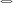

# Geometric Neural Networks  

IMPORTANT: This project is not yet finished!

  
Classical neural networks are based on [classical calculus](https://en.wikipedia.org/wiki/Calculus) of Newton and Leibniz. One might ask if there are useful alternatives?  
  
## Why classical calculus?  
  
We mainly focus on derivatives: Classical calculus derivatives are additive:  
  
  
  
This property is very helpful to differentiate linear functions like:  
  
  
One can use different well-known optimization methods which are based on these derivatives.  
  
## "Non-classical" calculus?  
  
What even is this? [Wikipedia](https://en.wikipedia.org/wiki/List_of_derivatives_and_integrals_in_alternative_calculi) might help you, but if you read the next few lines, it might be even easier for you, to follow my idea.  
  
You probably already know the intergral operator: . You probably know that this is somehow a continuous version of . These two operators are closely related. There is also a multiplication-operator  which computes a product over a discrete set of numbers. But, is there also a continous version of this operator? Actually, it is not that hard to derive a continuous version:  
  
  
  
  
Now, we can replace the  by the integral operator. This results in:  
  
  
  
Cool, we have a continuous product operator. There is a well-known syntax for this operator (which I actually do not like too much, but it is ok):  
  
  
  
We can even remove the limits:  
  
  
  
This "new" integral-like operator has some interesting properties, probably the most important are:  
  
  
  
  
  
One might think about to invert this operator, which is actually quite easy. We denote the resulting expression as :  
  
  
  
This operator is also multiplicative and has another interesting property: It removes any constants from the input function:
  
  
  
  
  
As it can be seen easily, this operator cannot handle functions with zeros: The operator is undefined for any position which results in a zero value. As it can be done for  
the "normal" derivative, we can derive the chain-rule and many other simple derivative rules for this operator. One might find the following derivative rules:  
  
  
  

A useful property is that the derivative is multiplicative: This allows a much more efficient computation of the multiplicative derivative of products (compared to the classical derivative), because each factor (=function) can be handled independent of each other.

<!--Using backpropagation, this results in a quite nice algorithm. Even better, by knowing the following rule, this new knowledge can also be used to compute classical gradients more efficient for products:

How can this improve the computation of the classical gradient? This is actually a very nice trick. Given the following functions:

How can we compute the gradient of the function  at a fixed position, given we evaluate the function at this position (forward pass in a neural network)? Of course, we can use the classical chain rule:
-->

The "classical" gradient descent is defined as:

Which can be written as:

Of course, given a neural network,  is usually  and describes weights.

Very similar, we can define a multiplicative gradient descent:

One might ask, what this "optimization" method does? Or even more basic: What is the geometric meaning of this multiplicative derivative? For the classical derivative,
we all know that it is the tangent of the function at a given point. It shows in which direction the function increases (a positive derivative means the function grows
with a higher  value and  means the function decreases). The multiplicative derivative on the other side, shows in which direction the absolute value of the function
increases: This means it show the direction away from . This is not given by the absolute value, but by a factor: If the multiplicative derivative is , then the function
will have a larger absolute value with a larger  and if it it , then the function will have a smaller absolute value with a larger .

The multiplicative gradient descent therefore divides by the multiplicative gradient. Unfortunately, the multiplicative gradient is independent of the absolute position of 
and for large  this division can create very large steps. For this reason, the proposed corrected multiplicative derivative is:

## What do you try to show?

I want to show that the multiplicative derivative can be useful to optimize neural networks. Especially multiplicative neural networks. I want to show this with a minimal library
that implements simple neural networks and which can be seen as a proof-of-concept that this (maybe?) new method works. Or that it does not work.

