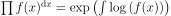

# Geometric Neural Networks

Classical neural networks are based on [classical calculus](https://en.wikipedia.org/wiki/Calculus) of Newton and Leibniz. One might ask if there are useful alternatives?

## Why classical calculus?

We mainly focus on derivatives: Classical calculus derivatives are additive:

This property is very helpful to differentiate linear functions like:

One can use different well-known optimization methods which are based on these derivatives.

## "Non-classical" calculus?

What even is this? [Wikipedia](https://en.wikipedia.org/wiki/List_of_derivatives_and_integrals_in_alternative_calculi) might help you, but if you read the next few lines, it might be even easier for you, to follow my idea.

You probably already know the intergral operator: . You probably know that this is somehow a continuous version of . These two operators are closely related. There is also a multiplication-operator  which computes a product over a discrete set of numbers. But, is there also a continous version of this operator? Actually, it is not that hard to derive a continuous version:

Now, we can replace the  by the integral operator. This results in:

Cool, we have a continuous product operator. There is a well-known syntax for this operator (which I actually do not like too much, but it is ok):

We can even remove the limits:

This "new" integral-like operator has some interesting properties, probably the most important are:

One might think about to invert this operator, which is actually quite easy. We denote the resulting expression as :

This operator is also multiplicative and has another interesting property: It removes any constants from the input function:

As it can be seen easily, this operator cannot handle functions with zeros: The operator is undefined for any position which results in a zero value. As it can be done for
the "normal" derivative, we can derive the chain-rule and many other simple derivative rules for this operator. One might find the following derivative rules:

TODO: rules

